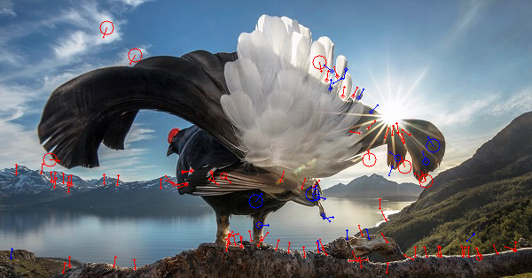
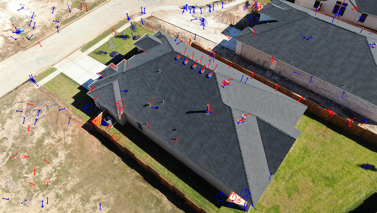
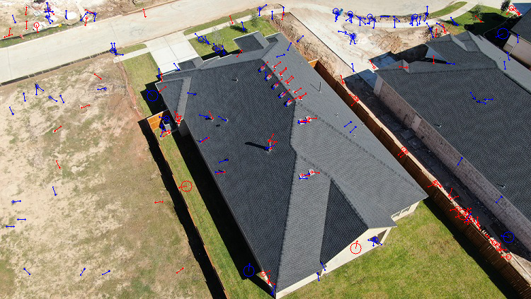
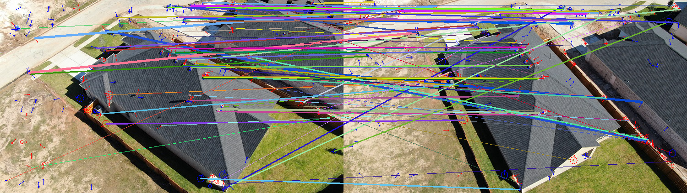

# ORB detector and Match algorithm python implementation
## Background
 Inorder to understand ORB deeply, I wrote this project in python without using the opencv ORB implementation.

 
 
 If you have learned the ORB algorithm and are not really good at C++, but want to know more details about ORB. Recommend you to read this project.
## Requirements
 this project require opencv-python, numpy, tqdm
```
pip install -r requirements.txt
```

## Usage
ORB feature is implemented in a single file "ORBFeature.py" . You can read main.py to know how to use this code.

## Results

### ORB Features




### Matching Result


## todo
* add more comments
* simplify code
* speed up runtime

## License
[MIT](LICENSE) © Jiaxi Sun
